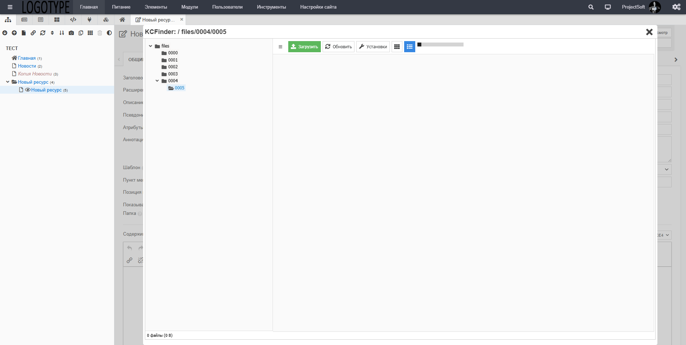

# Evolution CMS Utilites

## Описание

Набор плагинов для Evolution CMS

**Плагин `DirectoryUtilites`** для Evolution CMS обеспечивает автоматическое создание директорий ресурса на основе его родительских элементов.

Например, для ресурса с `ID=2` вложенным в ресурс с `ID=1` будут созданы директории `0001/0002` в директориях `files`, `images`, `media`. Что позволяет быстро найти нужную директорию ресурса и контролировать все файлы для данного ресурса.

Так же, при входе или выходе из административной панели, будет происходить автоматическое удаление пустых директорий в директориях `files`, `images`, `media`.

Настройка плагина `DirectoryUtilites` имеет один параметр `Длина имени директории`. По умолчанию установлен в `4` символа. Максимальную длину можно установить до `10` символов.

**Плагин `AdminBarLogo`** для Evolution CMS имеет один параметр - `Логотип в Админ Панели`. К логотипу будет применён ресайз до размера 140x40

### Установка

Установку плагина нужно провести через административную панель Evolution CMS.

+ Скачать  для Evolution CMS.
+ Войдите в административную панель Evolution.
+ Перейдите в модули и запустите модуль `Extras`.
+ Загрузите скачанный файл плагина и установите его.
+ Дождитесь завершения установки.

### Настройка

### Скриншот

**Добавлен набор плагинов утилит:**

+ **AdminBarLogo** плагин для отображения Логотипа компании в административной панели.
+ **EvoTreeManager** плагин починки отображения трея при использовании плагина `ElementsInTree`. Замечена поломка отображения табов.
+ **RenderParams** плагин рендера параметров у модулей, сниппетов, плагинов. Исправлено отображение параметра типа `int`, добавлена поддержка параметров типа `color`, `image`, `file`. Расчитан на работу в EvolutionCMS v1.4.x. В EvolutionCMS v3.x.x он не нужен. Выпущены пулы для EvolutionCMS v1.4.x. Пока не выйдет обновление версии CMS плагин будет присутствовать в подборке.
+ **TinyMCE4CSS** плагин добавления возможности закрепить панель инструментов TinyMCE при прокрутке страницы.
